# Strata Boost — Crowdfunding Frontend

A React single-page application for **Strata Boost**, a community crowdfunding platform for strata and body-corporate buildings. Neighbours can create fundraisers for repairs and community projects, and others can pledge money or skills to help.

This frontend talks to the Strata Boost Django REST API (the `crowdfunding_backend` project) for auth, fundraisers, buildings, and pledges.

## Screenshots

| Screenshot | Description |
|------------|-------------|
|  | Homepage on desktop — hero section, stats carousel, and fundraiser cards. |
|  | Homepage on mobile — responsive layout. |
| 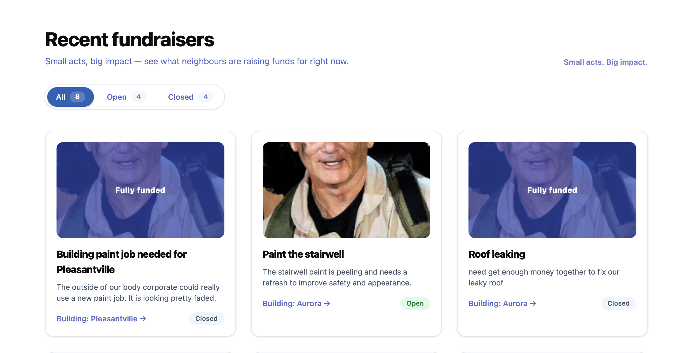 | Fundraisers listing on the homepage with filters and cards. |
| 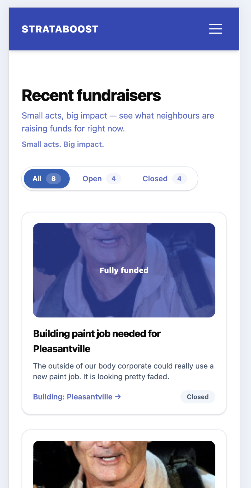 | Fundraisers view on mobile devices. |
| 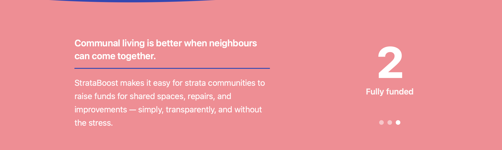 | Stats carousel component showing key metrics (pledges, fundraisers, etc.). |
| 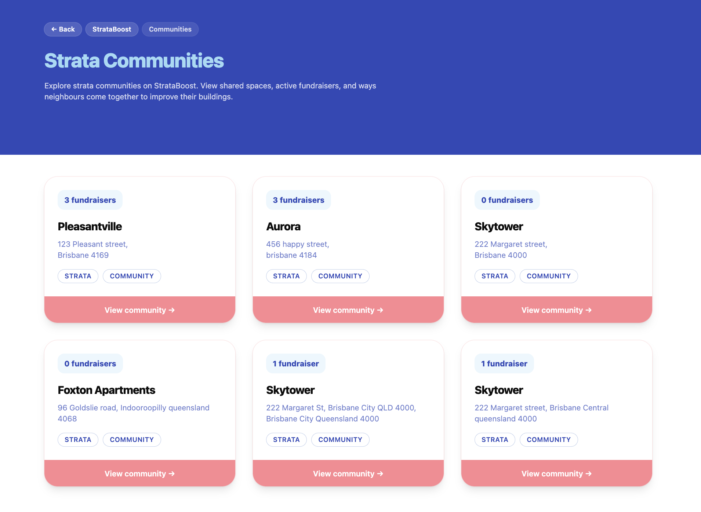 | Strata communities directory — buildings with fundraiser counts and links. |
| 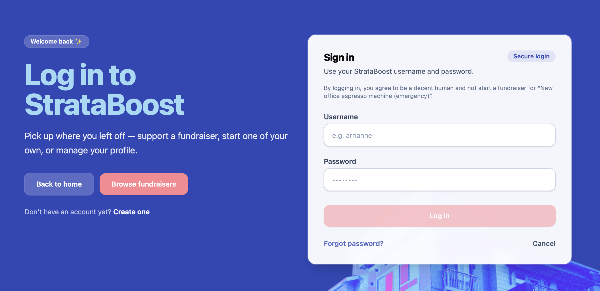 | Login page on desktop. |
| 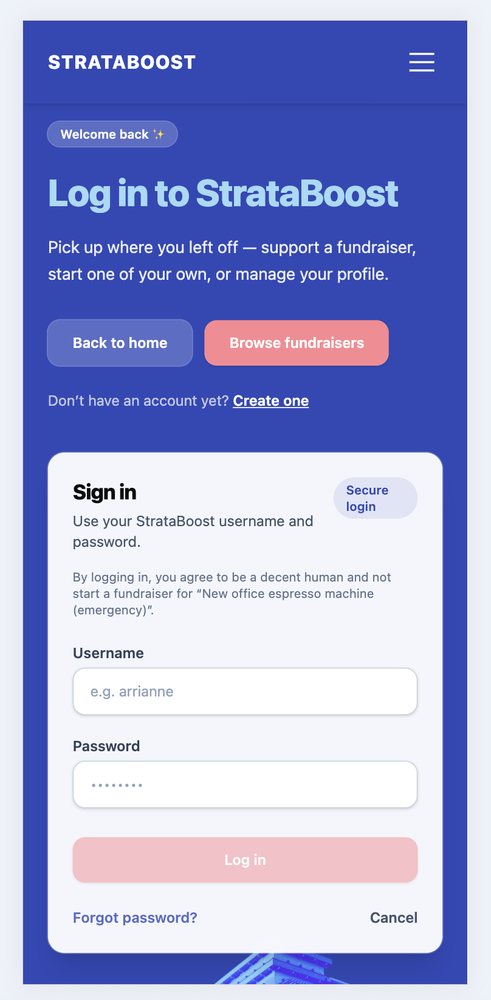 | Login page on mobile. |
| 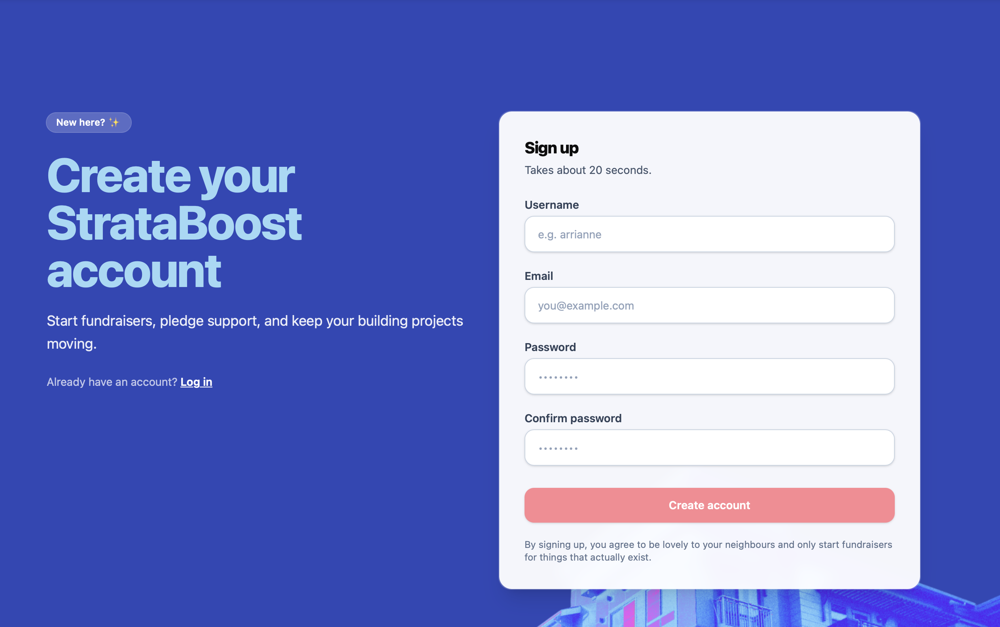 | Sign-up/registration page on desktop. |
| 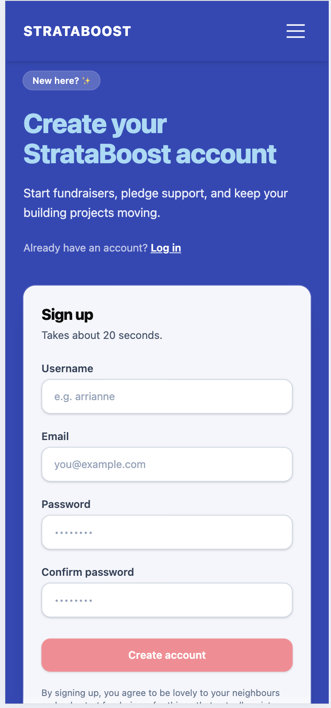 | Sign-up/registration page on mobile. |
| 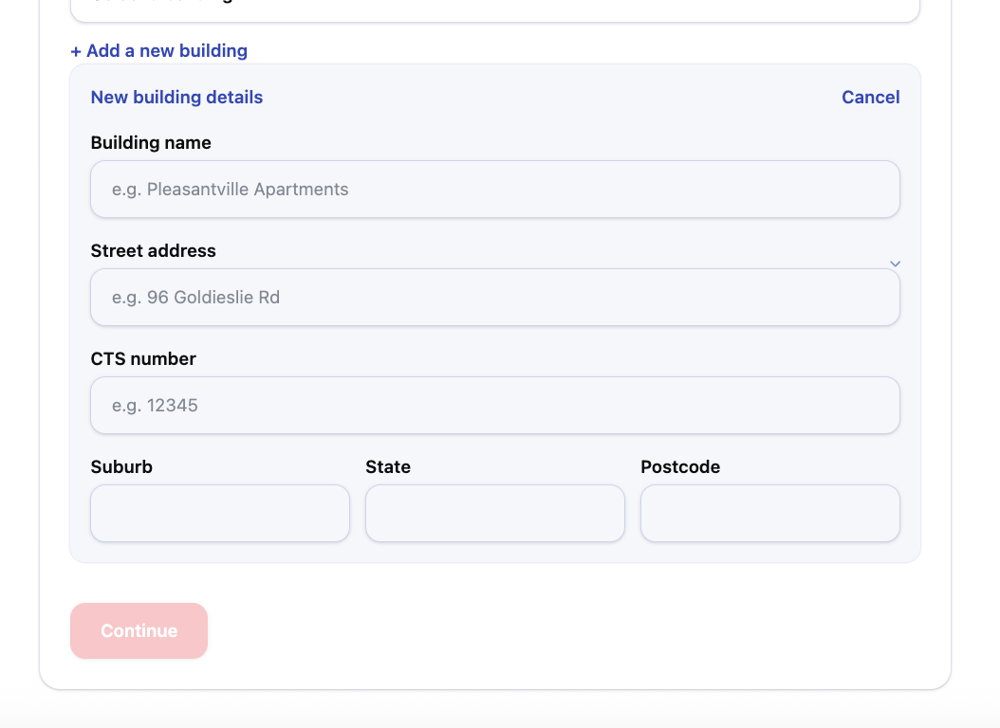 | Form for creating a new strata building/community. |
| 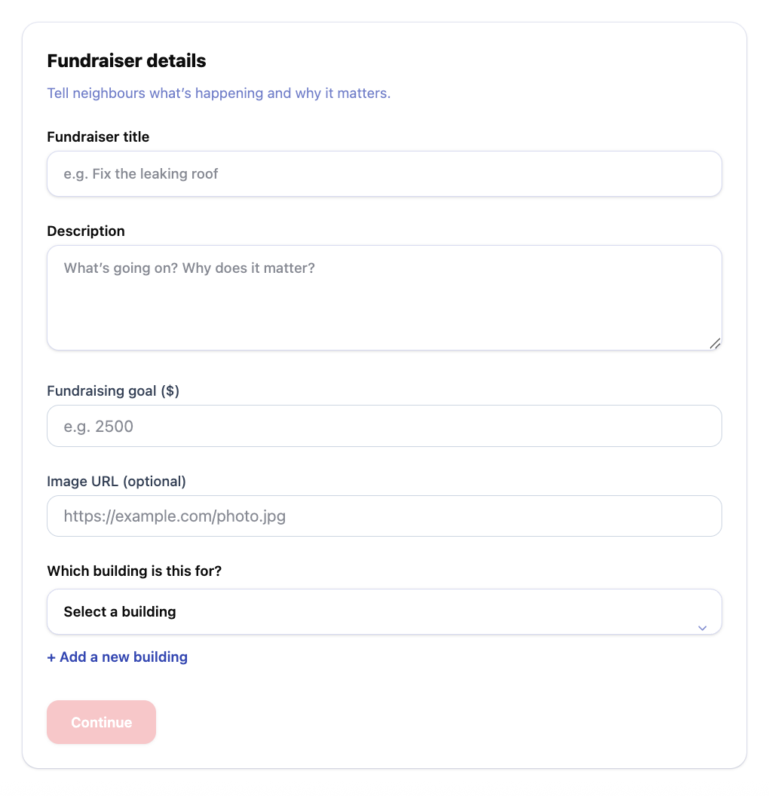 | Form for creating a new fundraiser. |
| 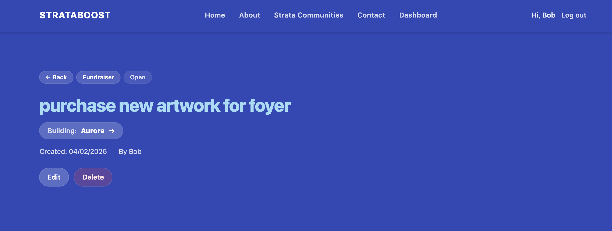 | Fundraiser detail view when logged in as the owner — Edit and Delete buttons are shown. |
| 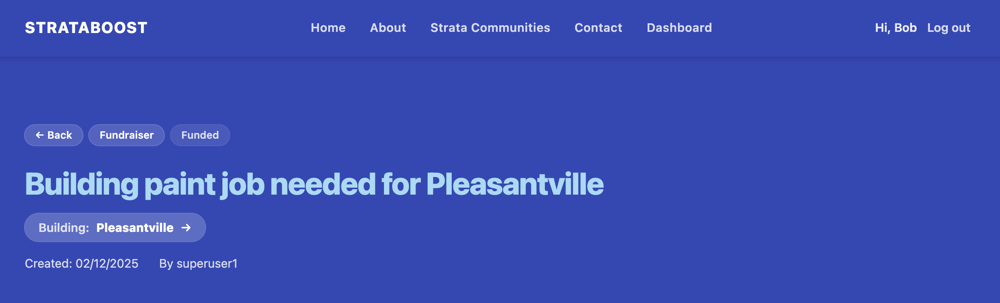 | Fundraiser detail view for non-owners — Edit and Delete buttons are hidden. |
|  | General app screenshot. |

## What it does

- **Browse fundraisers** — Home page lists all fundraisers with filters for open/closed status.
- **Fundraisers** — View a fundraiser, create a new one (when logged in), and edit or delete your own.
- **Buildings** — View strata buildings and their fundraisers; create or edit buildings when authorised.
- **Pledges** — Pledge money or skills to a fundraiser; view and manage your pledges on your user page.
- **Auth** — Sign up, log in, and token-based session (stored in `localStorage`). Protected routes for creating/editing content.
- **User page** — See your profile and list of pledges.
- **Static pages** — About and Contact; Strata Communities directory.

## Tech stack

- **React** 19 + **Vite** 7
- **React Router** 7 (client-side routing)
- **Tailwind CSS** 4 (via `@tailwindcss/vite`)
- **ESLint** (React hooks + refresh)

## Project structure

| Path | Purpose |
|------|--------|
| `src/api/` | Fetch helpers for users, buildings, fundraisers, pledges, login/signup |
| `src/components/` | Reusable UI (Layout, NavBar, Footer, forms, cards, auth) |
| `src/hooks/` | Data hooks (e.g. `useFundraisers`, `useBuildings`, `useAuth`) |
| `src/pages/` | Route-level pages (Home, Fundraiser, Building, User, Login, etc.) |

## Getting started

### Prerequisites

- Node.js (v18+ recommended)
- The Strata Boost backend (`crowdfunding_backend`) running locally or deployed

### Install and run

```bash
npm install
```

Create a `.env` in the project root with the backend API base URL:

```env
VITE_API_URL=http://localhost:8000
```

For a deployed backend, use that URL instead (e.g. `https://your-api.herokuapp.com`).

```bash
npm run dev
```

The app will be available at the URL Vite prints (usually `http://localhost:5173`).

### Other scripts

| Command | Description |
|---------|-------------|
| `npm run build` | Production build (output in `dist/`) |
| `npm run preview` | Serve the production build locally |
| `npm run lint` | Run ESLint |

## Environment variables

| Variable | Required | Description |
|----------|----------|-------------|
| `VITE_API_URL` | Yes | Base URL of the Strata Boost backend API (no trailing slash). |

## Backend

This app expects the Strata Boost Django REST API for:

- Users, auth (`/api-token-auth/`, `/users/`)
- Buildings (`/buildings/`)
- Fundraisers (`/fundraisers/`)
- Pledges (`/pledges/`)

See the backend repository for API details, auth, and deployment.
